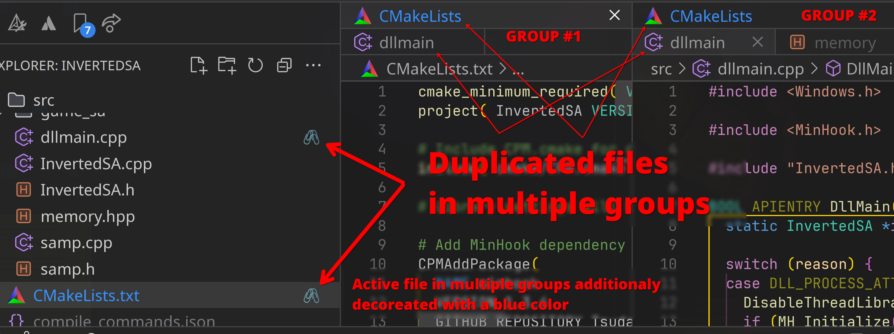

# Highlight Groups Duplicates VSCode Extension

Highlights files open in multiple editor groups by decorating their tabs with a badge and custom color.


[](https://marketplace.visualstudio.com/items?itemName=sr-team.vscode-hl-filedups)
[](LICENSE)



## Features

- Automatically highlights duplicate file tabs across groups (excluding the active group).
- 🛠️ Uses VSCode's FileDecorationProvider API.

## Usage

1. Install dependencies:
   ```bash
   npm install
   ```

2. Compile the extension:
   ```bash
   npm run compile
   ```

3. Launch in VSCode Extension Development Host:
   ```bash
   code --extensionDevelopmentPath=.
   ```

4. Open multiple editor groups and focus a file to see duplicates highlighted.

## License

MIT © SR_team

## Changelog

See [CHANGELOG.md](CHANGELOG.md).
